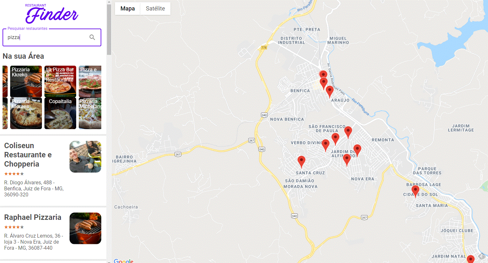

# Resturants Finder

Resturants Finder is the project from a course from [Digital Innovation One](https://digitalinnovation.one/) and it´s made with [React](https://reactjs.org). 


<p align="center">
    
</p>

---

# Guide

* [Features](#features)
* [Installation](#installation)
* [Using](#using)
* [Technologies](#technologies)
* [Future Implementations](#future-implementations)


# Features

*  Users can search for resturants.
*  User can search by just writing the name of the food, place, etc.
*  We have Carousel to display previews.


# Installation

**You will need install:**

 [Node.js](https://nodejs.org/en/download/) <br />
 [Yarn](https://classic.yarnpkg.com/en/) 

**Cloning repository**

```git clone https://github.com/cledman/fetch-restaurant```

**Install dependencies **

```yarn install```

**Configuration from ENVIRONMENT VARIABLES**

check the .env.example to post your Environment Variable an put that on an .env file.

# Using

```yarn start```

# Technologies

* [NodeJS](https://nodejs.org/en/) to handle the server, 
* [React](https://reactjs.org) to handle the rendering, 
* [Redux](https://redux.js.org/) to handle State container,
* [Styled Components](https://www.styled-components.com/) to handle components and styles, 
* [Material](https://material-ui.com/pt/) to handle the styles too, 
* [React Slick](https://react-slick.neostack.com/) to handle carousel, 
* [React Rating Stars](https://www.npmjs.com/package/react-rating-stars-component) for rating restaurants
* [React lottie](https://www.npmjs.com/package/react-lottie) to handle animations, 


# Future Implementations

*  Create categories pages.
*  Modal windows for messagens and alerts
*  Themes changes
*  Better UI

Thanks to:
* [Patrick Narciso](https://www.linkedin.com/in/patricknarciso/) and  [Digital Innovation One](https://digitalinnovation.one/)
##